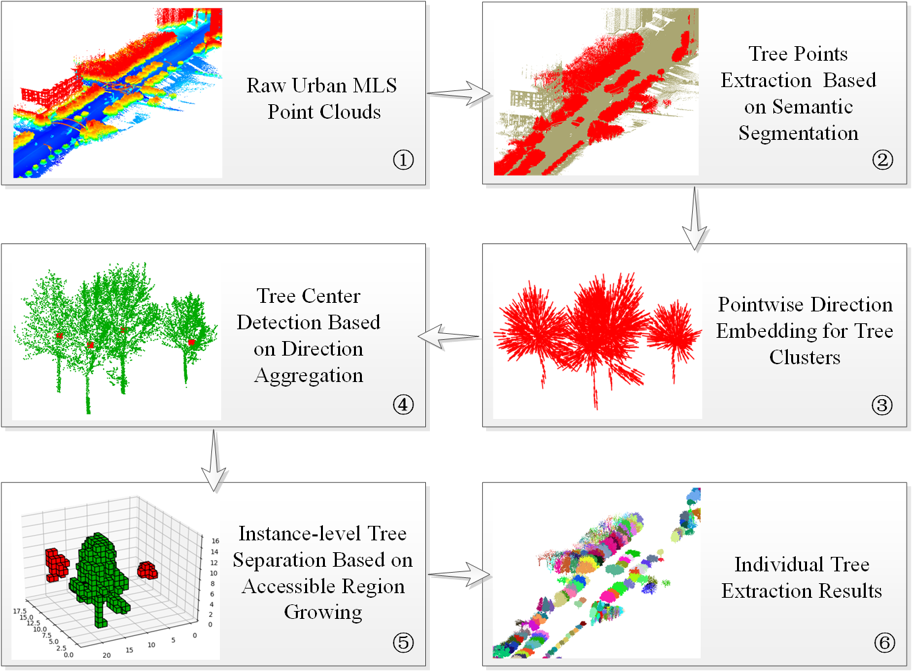

# Individual Tree Extraction

This is an implement of our paper that has been published in ISPRS Journal of Photogrammetry and Remote Sensing:

[**Individual Tree Extraction from Urban Mobile Laser Scanning Point Clouds Using Deep Pointwise Direction Embedding**](https://www.sciencedirect.com/science/article/pii/S0924271621000654?via%3Dihub)

Haifeng Luo, Kourosh Khoshelham, Chongcheng Chen, and Hanxian He

# Introduction:
In this paper, we propose a novel top-down approach to extract individual trees from urban MLS point clouds. Firstly, a semantic segmentation deep network is applied to segment tree points from raw urban MLS point clouds, and then the segmented tree points are further grouped into a set of tree clusters using Euclidean distance clustering. Next, a pointwise direction embedding deep network (PDE-net) is proposed to predict the direction vectors pointing to tree centers for each tree cluster to enhance the boundaries of instance-level trees. After that, a direction aggregation-based strategy is developed to detect the tree centers for each tree cluster, and the clusters are classified into single-tree clusters and multi-tree clusters based on the number of detected tree centers. Finally, the single-tree clusters are directly extracted as individual trees, while the multi-tree clusters are further separated into instance-level trees based on our proposed accessible region growing algorithm combining the embedded pointwise directions and detected tree centers.

This repo does not contain the source code of semantic segmentation. In theory, any exsiting semantic segmentation framework can be used to extract the tree points, such as DGCNN, PointASNL, MS-RRFRSegNet.

# Requirment:
    Python 3.6
    Tensorflow 1.80
    Cython

# Train PDE-net:

To train the PDE-net:

    cd backbone_network
    python PDE_net_training.py

* Data format of training samples: [x, y, z, tree_id]

# Compile Voxel-based Region Growing:

    cd voxel_region_grow
    python VoxelRegionGrow_Setup.py build_ext --inplace   

# Extract Individual Trees:

To extract the individual trees from tree clusters:

    python IndividualTreeExtraction.py
    
* Data format of the input tree clusters: [x, y, z]

* Data format of the output results: [x, y, z, r, g, b, tree_id]

# Citation:

If you find this project useful for your research, please kindly cite our paper:
    
    @article{luo2021individual,
    title={Individual tree extraction from urban mobile laser scanning point clouds using deep pointwise direction embedding},
    author={Luo, Haifeng and Khoshelham, Kourosh and Chen, Chongcheng and He, Hanxian},
    journal={ISPRS Journal of Photogrammetry and Remote Sensing},
    volume={175},
    pages={326--339},
    year={2021},
    publisher={Elsevier}
    }
    
# Contact

If you have any questions, please contact [Haifeng Luo](h.feng.luo@outlook.com).
